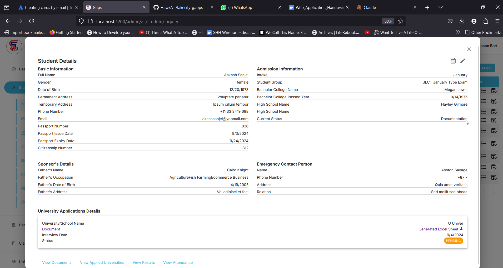

## Assigning new Student to University

We can assign students to university for the interview.
- Go to University -> Assign Student
- Fill in the required form to assign student and set the interview date.

### Accepting or Rejecting Students in the University

After the student has been put for interview after assigning the student to the University, we can accept/reject them.
To accept/reject the student follow the steps below:

- Go to University -> University List
- Click on the eye button of the University (as in the image below)
- This will provide you the list of students reserved for that university for interview.
- If accepted, click on **Approve**. This will increase the count of student in the university.
- If rejected, click on **Reject**.
- By default, after assigning a student to a University - the student will be in **Pending** mode.

If the student is acccepted or rejected - the time will be displayed on the table as below:

### Viewing the Student Excel Spreadhsheet related to University

After you have assigned the student to a Univeristy, an Excel Sheet will be generated for that specific student to the University that you are applying.

To view and download the Excel Sheet, you can follow the steps :
- Go To Student --> Student List
- Select the student that you have just Applied, and click on "Edit".
- Now click on "View Applied University" link.
- From here, you can download the generated Excel sheet and review the data.

