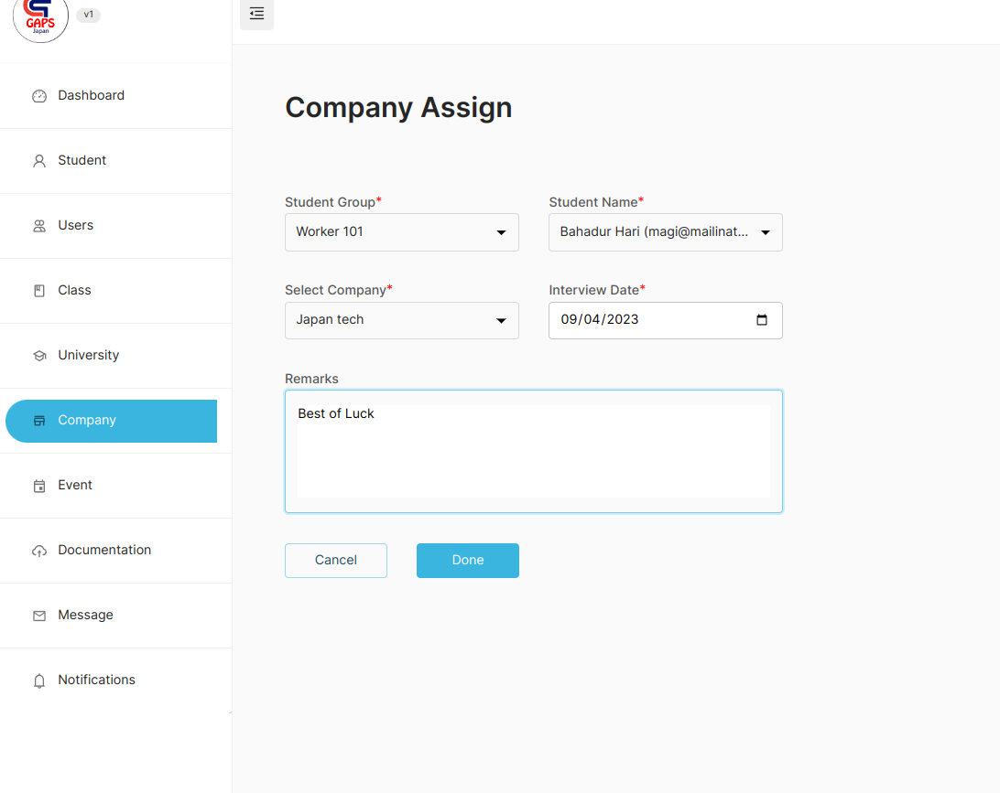
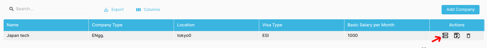
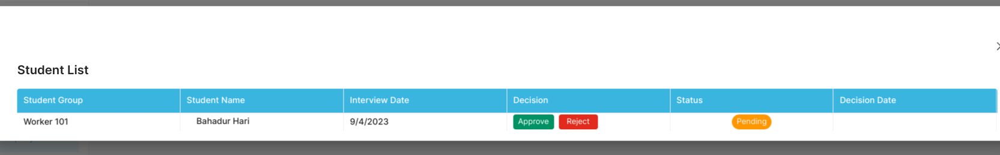
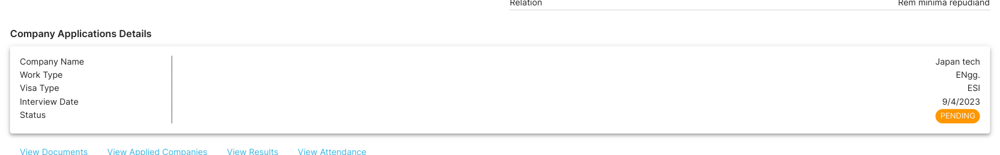
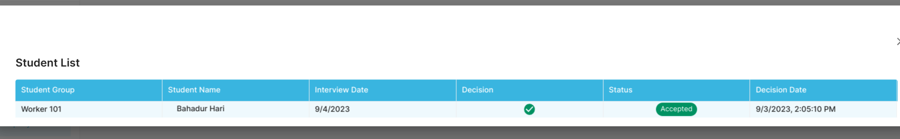

## Assigning a Company to Worker

We can assign workers to company for the interview.

:::warning Pre-requisite

To assign a worker to a company, you must have a company created. If not created, **_[Click Here](/src/addcompany)_** and Work Type created. If not created, **_[Click Here](/src/worktype)_**

:::

- Go to Company -> Assign Company
- Fill in the required form to assign student and set the interview date.

### Accepting or Rejecting Workers in the Company

After the worker has been put for interview after assigning the wroker to the company, we can accept/reject them.
To accept/reject the worker follow the steps below:

- Go to Company -> Company
- Click on the Box Icon Side of Edit Icon of the Company List (as in the image below)

- This will provide you the list of workers reserved for that company for interview.
- If accepted, click on **Approve**. This will increase the count of worker in the company.
- If rejected, click on **Reject**.

- By default, after assigning a worker to a Company - the worker will be in **Pending** mode.

If the student is acccepted or rejected - the time will be displayed on the table as below:

:::info For Accept Case

:::
