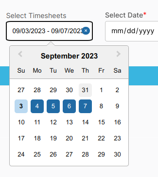
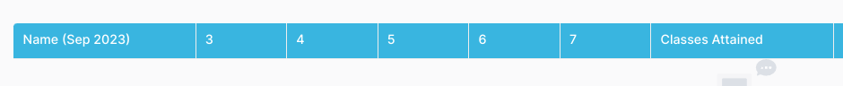
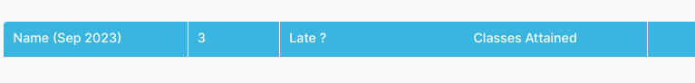

### To mark the attendance for the students, please follow certain steps:

- Navigate to the Attendance Section from the Sidebar Under Student.
- Firstly, Filter the students by selecting the Student Group.

::: info Options
You can filter the attendance date through two Options for ease of use: **TimeSheets** and **Selecting Single Date** .
:::

::: details TimeSheets
Timesheets will show the range of dates for which you want to show the days.

:::

:::details Selecting Single Date
Selecting Single Date will show the attendance table for the selected date.

:::

- To mark the attendace for Specific Day, Click on the Number on the Heading of the Table.
- This will generate the three Infos: **Day**, **isLate** (for Marking Student as Late ) and **Total Classes Attend**
- Click on the Checkbox to mark the student as present. If the student is late, click on the **isLate** Button.
- To Cancel the Student as Late, click on the **Cancel Late** Button.
- To return to the All Days, Click on the Table Header.

The changes will be reflected on the Student Portal as well.
