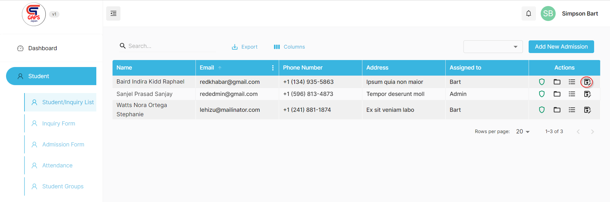
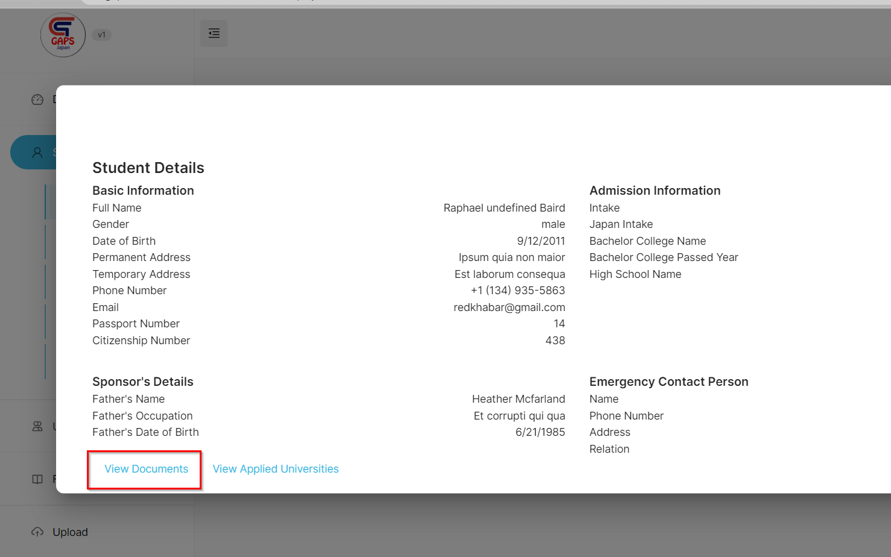
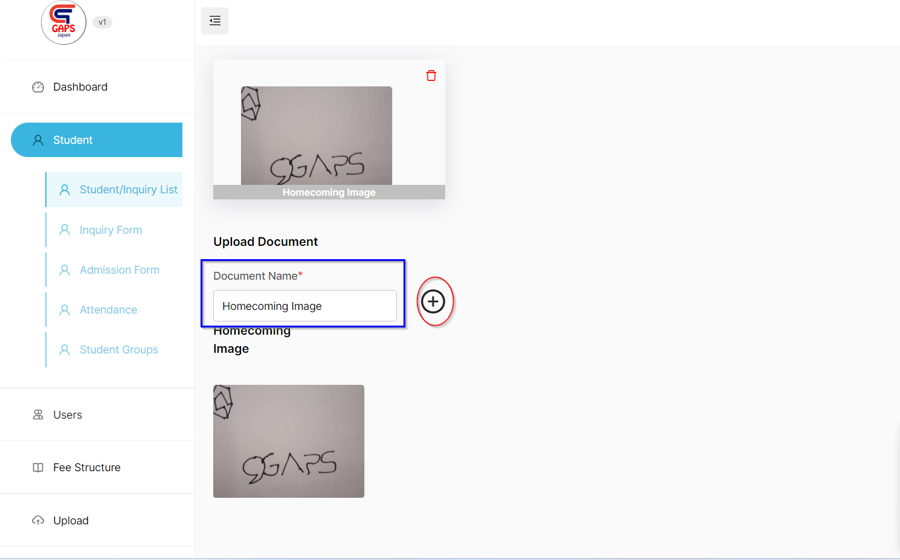

## How to add Documents for Students from Admin Side

Sometimes, we may need to add documents of Student from the admin side. For that, we have facilitated a service to add documents for a student from Admin side.

**Steps**
- Go to Student -> Student/Inquiry List
- Click on the Edit button as described on the image below

- Now click on the "View Document"  as described on the image below.

- Now you will be redirected to Upload page. Give the title to doucment and then press the + button to add new documents.

