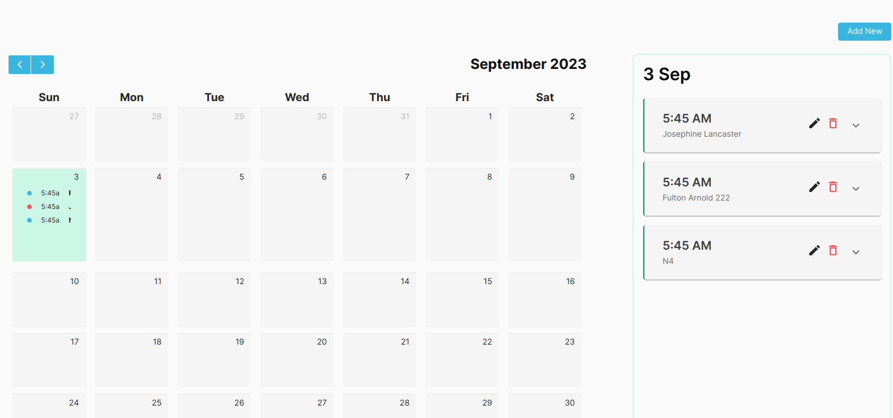
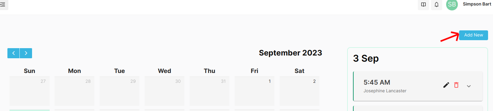
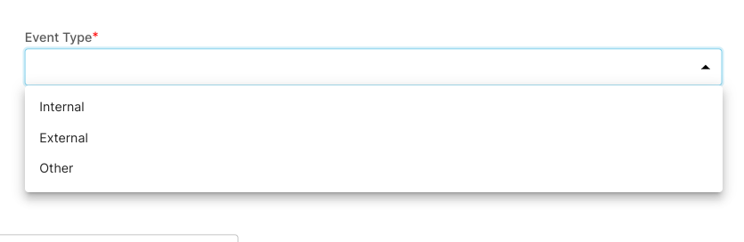

## Event

Event is any kind of activities created by Admin or automatically created in the case of Exam.

## Creating Events

:::details In Case of Exam (Image Attached)
Events for exam are created automatically after it has been created and is reflected on the Student Portal Event as well.

:::

- Navigate to Event -> Event
- Click on **_Add New_** Button to create New Event

- Specify the Type of Event you want to Create

- Click on **_Save_** to create a event. The created event will be displayed in the Event Calendar and Student Dashboard as well.
