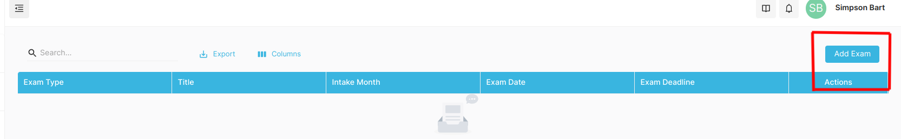
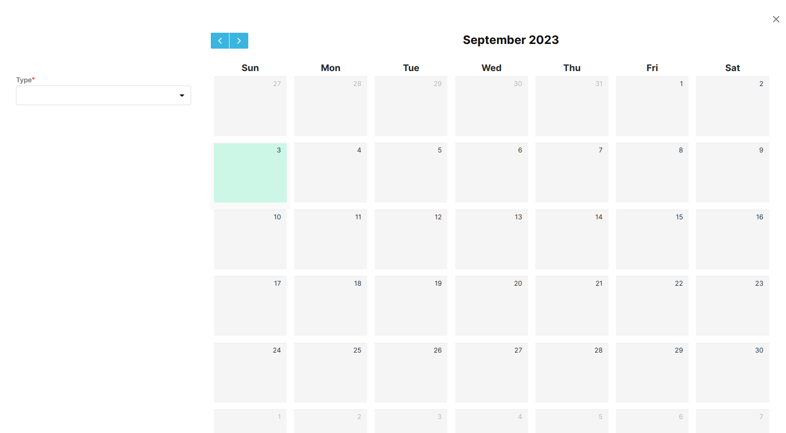

## External Exam

External Exam is set by the External agency for the students. The admin can set the exam date for the students. The students can view the exam date and the exam date will be displayed in the student dashboard.

### Setting up External Exam

- Navigate to Event -> External Exam
- Click on the **_Add Exam_** Button. (Refer to Image below)

To create a External Exam, follow the steps below:

- Firstly, Specify the type of Exam
- Click on the Date on the Calendar on which day the External Exam will be conducted.

::: warning Note
You have to specify Exam type to further create the Exam
:::

- Fill in all the required fields.
- Click on the **_Save_** Button to save the External Exam.

The External Exam will be displayed in the External Exam List and the student can view the External Exam in the student dashboard.

## Filtering the External Exam by Student Group

- Navigate to Event -> External Exam
- Click on the **_Eye_** Button. (Refer to Image below)

- Filter the Student Group for External Exam for student to be notified, Add Images related to Exam

The Students in Specified Student Group will get now the nofification about the External Exam
