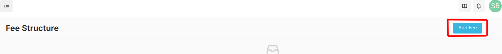

To add fee structure, follow these steps:

- Navigate to the Fee Structure Section from the Sidebar.
- Click on the "Add Fee" button.

  

- Upload the file containing the fee structure.
- The fee structure will be uploaded and displayed in the table. The uploaded fee structure will be visible on the Student Portal as well.
