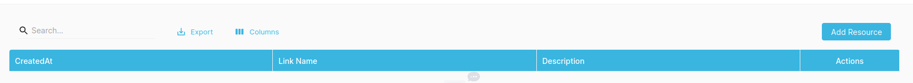
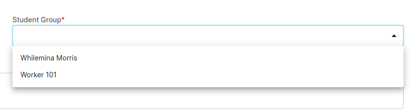

## Adding Resource by Instructor

Resources are additional link or reading material detail provided by the instructor to the students.

## Creating Resource

- Navigate to Resources in Sidebar of Instructor Dashboard.
- Click on **_Add Resource_** button.

- Specify the Student Group that you want to show the resource

After, the resources has been created, the resources will be visible on both instructor and student dashboard as well.
