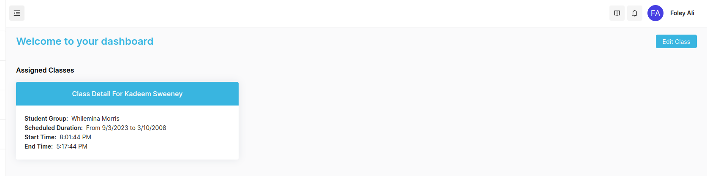
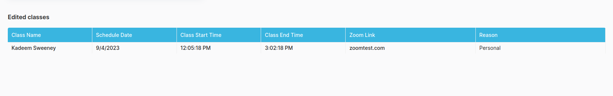

## Instructor Edit Class

Instructor can edit the timings and other details for the Classes assigned by the admin.

To edit the class, follow these Steps:

- Navigate to Instructor Dashboard
- Click on **_Edit Class_** button (Refer the image)

- After the class has been edited, the edited classes will be shown in table and the notification for the changed details will be sent to Admin and Student.

