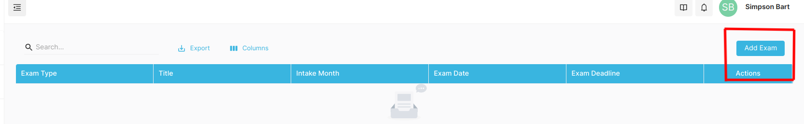
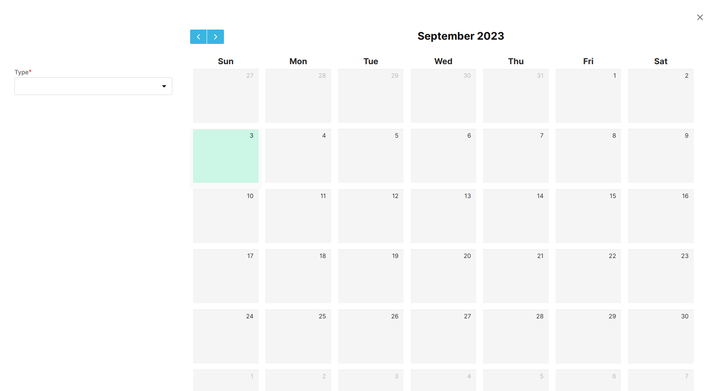
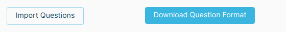

## Internal Exam

Internal Exam is set by the Gaps Consultancy. The admin can set the exam date, Questions, Time, and Groups for the students. The students can view the exam date and the exam date will be displayed in the student dashboard and give the exam on the Date.

### Creating a Internal Exam

- Navigate to Event -> Internal Exam
- Click on the **_Add Exam_** Button. (Refer to Image below)

To create a Internal Exam, follow the steps below:

- Firstly, Specify the type of Exam
- Click on the Date on the Calendar on which day the External Exam will be conducted.

::: warning Note
You have to specify Exam type to further create the Exam
:::

- Fill in all the required fields.
- For Internal Exam , You have to set the questions first.

::: info
You can create questions either from manually or by uploading a file.
:::

## To Upload the Questions in Bulk

- Firstly, Download the Question Format by clicking on the "Download Question Format" button.

  

- Fill the downloaded format with the questions and answers.
- Upload the filled format by clicking on the "Import Questions" button.

## To Add Questions Manually

- Type in the question and the Answers.
- Choose the right answer for the question by clicking on the option and Saving it.
- After a question has been created, you need to Save it by clicking on the "Save" button.
- Continue the process until all the questions have been created.

:::info Optional Image
You can upload image as well for the questions.
:::

For the questions to be visible on the Inquiry Form, Save the questions created or uploaded by Selecting the "Save All Questions" button.

::: warning Note
Saving the questions is mandatory for the questions to be visible on the Inquiry Form.
:::

- Click on the **_Finish_** Button to save the Internal Exam.

The Internal Exam will be displayed in the Internal Exam List and the student can view the Internal Exam in the student dashboard.
