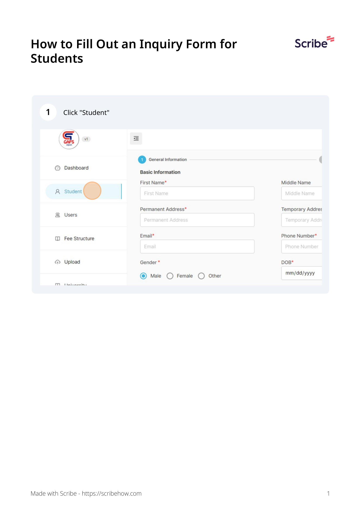
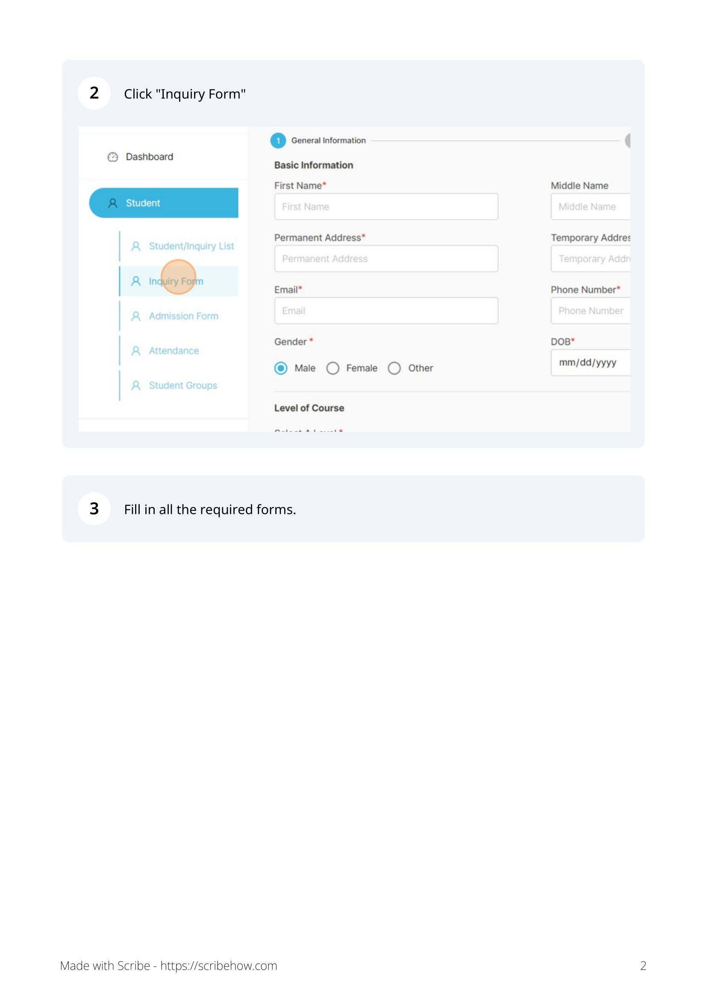
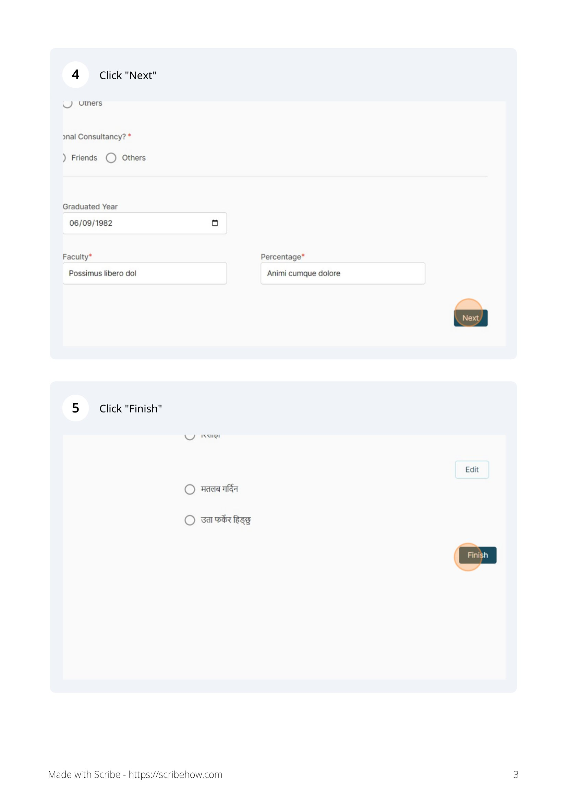
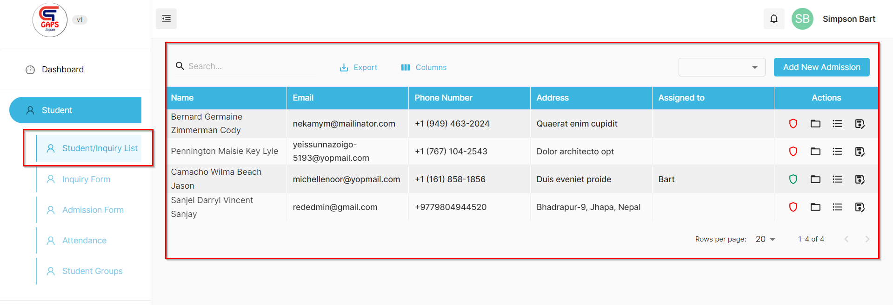

## How to create a new Inquiry ?

You can follow the following steps to create a new Inquiry.

***Steps***
- Go to Dashboard.
- Click on ***Student***.
- Click on Inquiry Form.

After inquiry is created, a new inquiry will be created and will be placed on **Inquiry List**.

