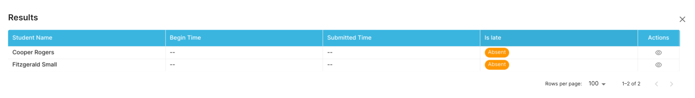
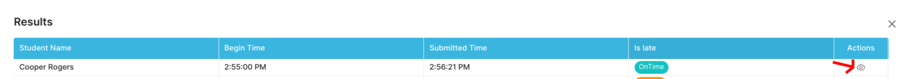
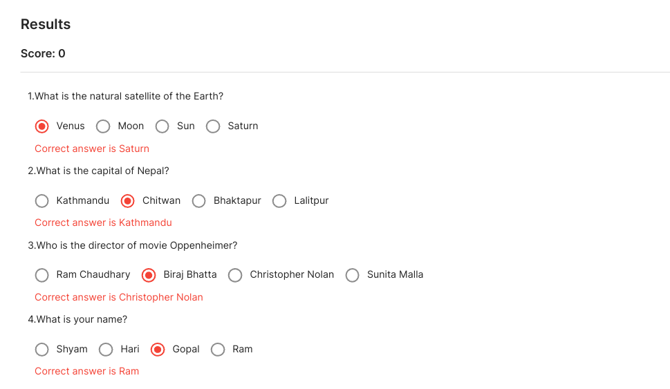

## Result

To Check the Result for the Internal Exam, follow these steps:

- Navigate to Event -> Result
- Click on the **_Eye_** Icon on the Actions of Particular Exam.
- Details about the Exam for Students will be displayed . (Refer to the image below)

- When the Student beings and Submit the Exam, the timings will be reflected on the Admin Result Side.
- If the Student successfully submitted the exam on time, the **_Absent_** chip will be changed to **_On Time_**.
- Click on the **_Eye_** Icon to see the result of the student.

- The total Score of the Exam will be displayed according to the answers submitted by the exam. In case the student marks incorrect answers, the **_Red_** marker will be shown and **_Green_** marker will be shown for the correct answer. The correct answer for the question will be shown as well.

