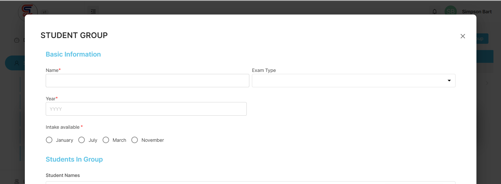

## What is Student Group?

Student Group  are group that we create to group students of similar interests.

Like ***N5 Morning Group***, or ***N4 July Group***.

This helps differentiate students reading different courses and enrolling in different classes.

## **Creating new Student Group**

To create a new Student Group navigate to the following :

- Go to Student on the Dashboard
- Click Student Groups
- A new modal will appear.
- Fill in all the forms

