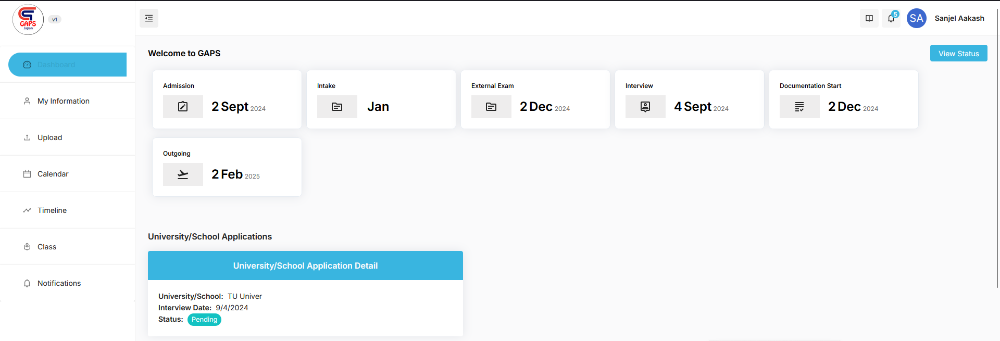
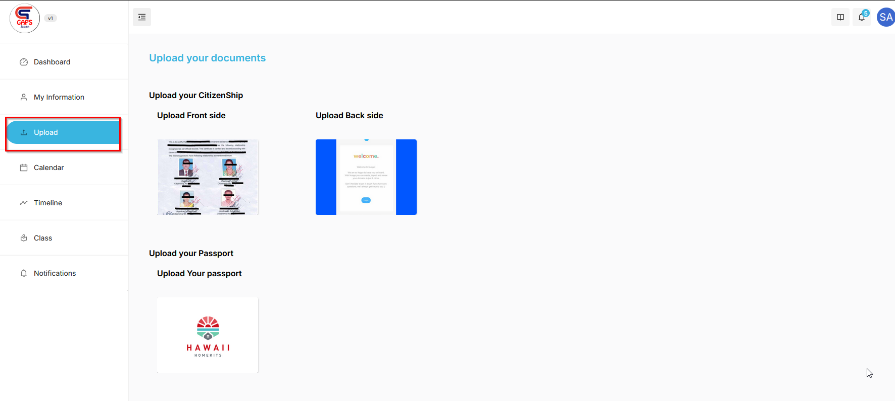
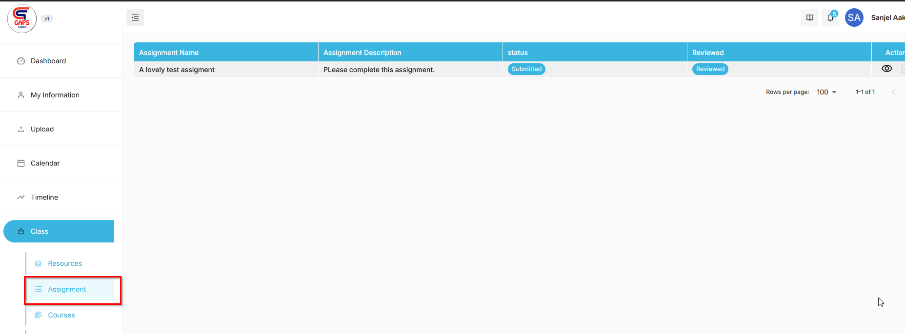
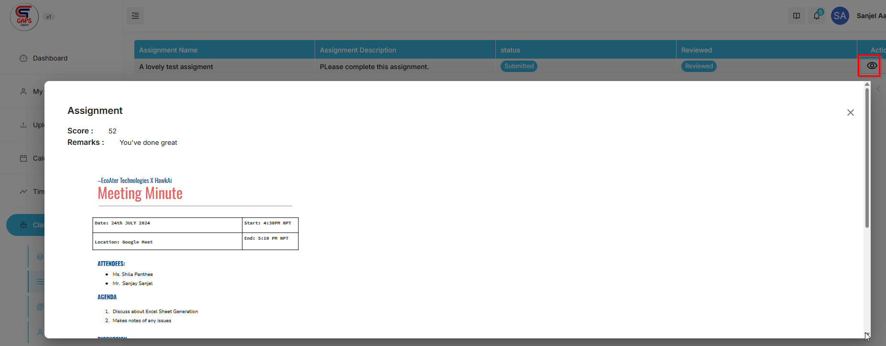

## Features from Student Dashboard

GAPS Student Dashboard is specially designed to provide all the relevant information about the student process to Student.
A student can view their profile and verify if all the entered information is correct or not.
- They can also upload the document, which makes way easier to manage the student documentation.

**Student Dashboard**

Here the student can view their 
- enrolled date
- Intake Month 
- External Exam Start Date 
- Interview Date Set with University 
- Documentation Start Date
- Outgoing Date

**Uploading Documents**

Student can upload any document easily from their dashboard.

**Information related to Resource, Exams and Results**

As a student you have access to all the resources that Admin and Instructor have added.
You can also preview and submit your assignments from the dashboard.

You can click on the "Eye" buton to view the results.

